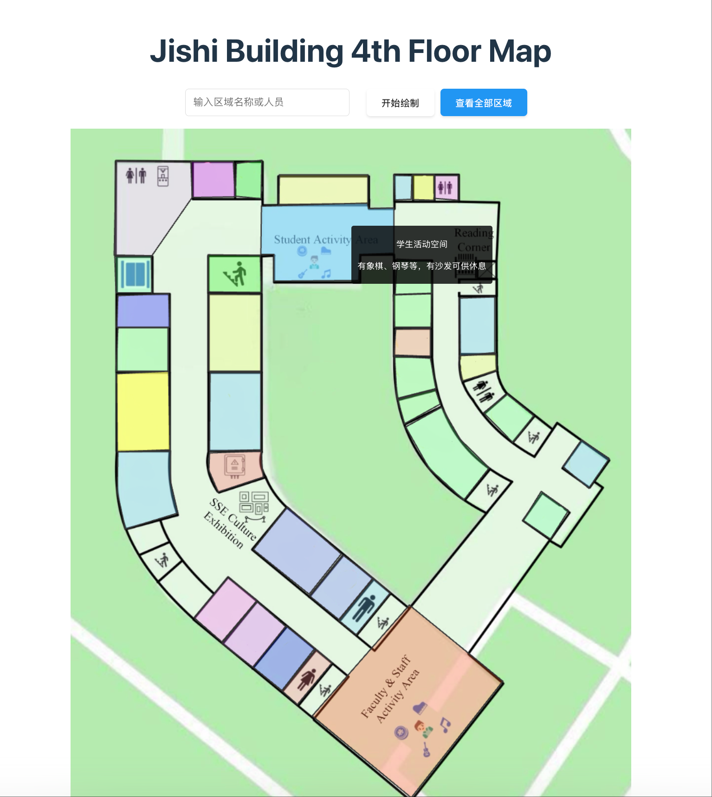
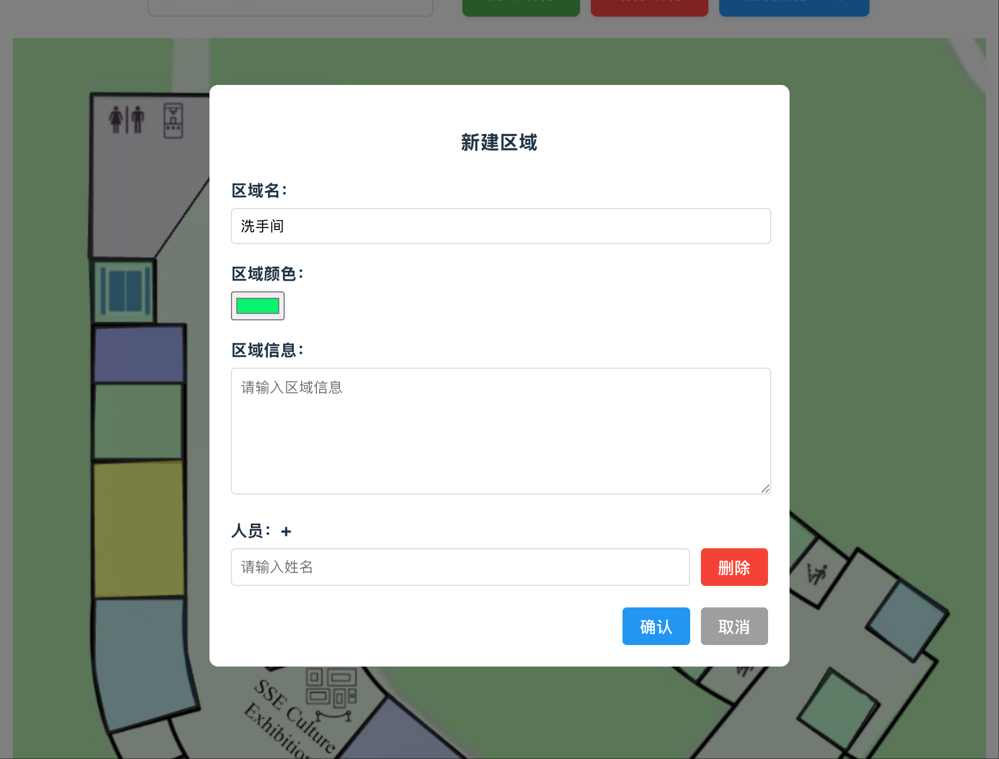
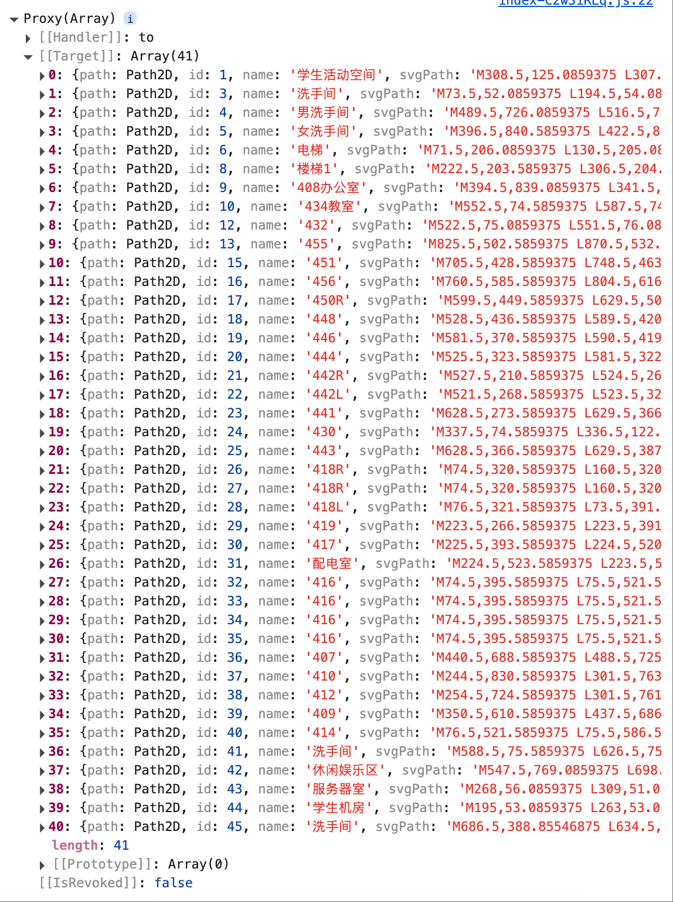

# Tongji Jishi Building IntelliMap

## 1. Introduction

This project aims to develop a navigation system for the 4th floor of the Jishi Building. The system allows users to virtually explore each room on the 4th floor and gain detailed information about the function of each room and its personnel. Through this system, users can obtain comprehensive information about the 4th floor of the Jishi Building, including room usage and staff assignments.

Designed for ease of use, the system enables users to quickly select and view specific rooms via an overview map or search for particular rooms or personnel using keywords, thereby enhancing the overall navigation experience.

This project is a dynamic website with a frontend, backend, and database. The technology stack includes:

-   Frontend: Vue 3 + Vite + TypeScript
-   Backend: Robyn
-   Database: MySQL
-   Server OS: Ubuntu

Anyone can visit the project website at: http://124.223.93.75:6052/

## 2. Project Requirements

### Functional Requirements

-   **Room Overview**: Provide a visual floor plan of the 4th floor of the Jishi Building, showing the location and number of each room.
-   **Room Selection and Viewing**: Users can view specific rooms by clicking on them directly on the floor plan or selecting them from a room list.
-   **Keyword Search**: Support keyword input (such as room name, job title, or personnel name) to quickly locate relevant rooms or individuals.

### Technical and Design Requirements

-   **Dynamic Web Design**: Develop a dynamic web page to serve as the user interface for the navigation system.
-   **Interface Layout**: Design the layout based on the principles of fluid navigation to ensure the system is easy and intuitive to use.

## 3. Design Principles and Rationale (Based on Fluid Navigation Principles)

The design of this project is based on the concept of Fluid Navigation, which aims to enhance the usability and interactive efficiency of the user interface. The goal is to ensure that users enjoy a smooth and seamless experience when using the software or website. The following design ideas guide this project:

### Intuitive Layout and Structure

An intuitive interface layout is designed to help users easily understand the application's structure and functions at a glance. This includes clear visual hierarchy, appropriate spacing, and prominent navigation markers to help users quickly identify interactive elements and navigate efficiently.

### Minimized Cognitive Load

To reduce the amount of information users need to remember, the interface is simplified through streamlined workflows and minimal interface elements. For example, using icons instead of lengthy text labels, and applying familiar UI patterns can help users understand and interact with the system more quickly.

### Consistency

Maintaining consistency is key to fluid navigation. This involves using a consistent color scheme, typography, layout, and interaction behaviors throughout the interface. A consistent design enhances user recall and minimizes confusion during use, ultimately improving the overall experience.

### Dynamic Interactions

Animations and transitions are used to enrich user experience. Appropriate dynamic effects not only enhance the visual appeal of the interface but also guide the user's attention and indicate interface changes. For example, using smooth transition animations during view switching or content loading reinforces the sense of continuity and prevents abrupt visual changes.

## 4. Demonstration

### Room Overview Page

### Add Room

### Show Room Info

